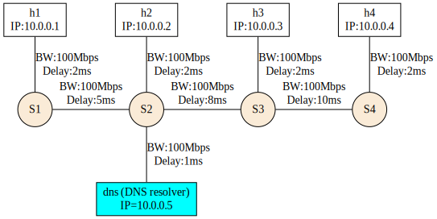

# Computer Networks (CS 331) Assignment 2

DISCLAIMER : Some scripts (mainly `config.sh` and `listener_setup.sh`) change global configuration in system, such as `/etc/resolv.conf` and affect connetivity to internet. 

## Part A



This mininet topology is created using the MiniNet Python API in the file `topo.py`. You can access it as :

```bash
sudo python3 topo.py --only_topo
```

Note that the `--only_topo` is necessary since I am using `topo.py` without arguments for part D.

The command might return a lot of warnings, namely about addling links with too high bandwidth. This is because of the linux kernel's initial settings which the MiniNet hosts inherit. These warnings are harmless.

Just before the prompt, you will see something like this :

```
*** Ping: testing ping reachability
dns -> h1 h2 h3 h4 
h1 -> dns h2 h3 h4 
h2 -> dns h1 h3 h4 
h3 -> dns h1 h2 h4 
h4 -> dns h1 h2 h3 
*** Results: 0% dropped (20/20 received)
*** Starting CLI:
mininet> 
```

This is the output of the `pingAll()` method that was executed from the python script before starting the CLI using `CLI(net)`.

You can recreate this by issuing the `pingall` command in the CLI.

```
*** Starting CLI:
mininet> pingall
*** Ping: testing ping reachability
dns -> h1 h2 h3 h4 
h1 -> dns h2 h3 h4 
h2 -> dns h1 h3 h4 
h3 -> dns h1 h2 h4 
h4 -> dns h1 h2 h3 
*** Results: 0% dropped (20/20 received)
mininet> 
```

This demonstrated connectivity between the hosts.

But for sake of completeness, you can also ping hosts indivisually as

```
mininet> h1 ping h2
PING 10.0.0.2 (10.0.0.2) 56(84) bytes of data.
64 bytes from 10.0.0.2: icmp_seq=1 ttl=64 time=18.8 ms
64 bytes from 10.0.0.2: icmp_seq=2 ttl=64 time=18.2 ms
64 bytes from 10.0.0.2: icmp_seq=3 ttl=64 time=18.1 ms
64 bytes from 10.0.0.2: icmp_seq=4 ttl=64 time=18.1 ms
^C
--- 10.0.0.2 ping statistics ---
4 packets transmitted, 4 received, 0% packet loss, time 3002ms
rtt min/avg/max/mdev = 18.129/18.317/18.849/0.306 ms
mininet> h1 ping 10.0.0.2
PING 10.0.0.2 (10.0.0.2) 56(84) bytes of data.
64 bytes from 10.0.0.2: icmp_seq=1 ttl=64 time=19.2 ms
64 bytes from 10.0.0.2: icmp_seq=2 ttl=64 time=18.2 ms
64 bytes from 10.0.0.2: icmp_seq=3 ttl=64 time=18.1 ms
^C
--- 10.0.0.2 ping statistics ---
3 packets transmitted, 3 received, 0% packet loss, time 2002ms
rtt min/avg/max/mdev = 18.137/18.518/19.174/0.465 ms
mininet> 
```

## Part B

The default host resolver for linux systems is the stub resolver bound to IP address `127.0.0.53` (or `127.0.0.54`) and port `53` (DNS). This stub-resolver is part of `systemd-resolved` . 

Whenever a process needs do to DNS resolution, it looks at a configuration file, such as `/etc/resolv.conf` (this is actually a sym-link) which has IP addresses for name-servers (local resolver server processes or actual DNs servers) that it goes through in the given order and tries to resolve its query.

```
nameserver 127.0.0.53
options edns0 trust-ad
search .
```

For example, adding `nameserver 8.8.8.8` (Google's public recursive DNS resolver) on before the stub resolver will give `8.8.8.8` more priority.

What we want is for the Mininet hosts to be able to use the machine's stub resolver. They will not be able to do that directly because the subnet that their IP addresses belong to is incompatible (unable to talk) with `127.0.0.53` and because their IP addresses only make sense in the MiniNet namespace; not in the real internet (no machine, including the local machine knows how to forward packets to a `10.0.0.x` address Mininet host process/thread). To make it valid, we must either introduce the MiniNet hosts to the internet (at least the laptop) via DHCP, or use Name Address Translation (NAT). I chose the second option.

To add a node that does the translation and communicates with the outside world, we can do `net.addNAT(name='n0').configDefault()` . To run `topo.py` with NAT, use this command :

```bash
sudo python3 topo.py --only_nat 
```

Now, we will be able to PING IP addresses that are not in the subnet that the topology sits in.

```

```
