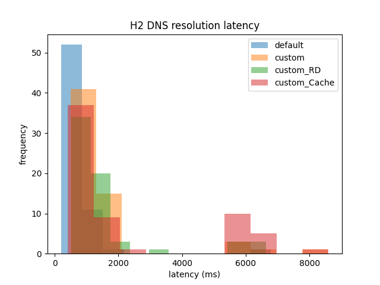
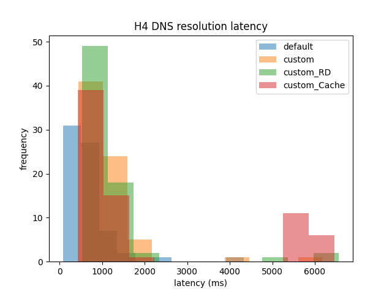

# Computer Networks (CS 331) Assignment 2

## Team

| Name | Roll no. |
| ---- | -------- |
| Pranav Joshi | 22110197 |
| Nishit | 22110172 |

## Assignment overview and deliverables

This project implements an end-to-end DNS measurement pipeline on a Mininet topology:
- A. Build the specified topology and demonstrate full connectivity among all nodes.
- B. Use each host’s default resolver to resolve URLs extracted from the host’s PCAP; record: average lookup latency, average throughput, number of successful and failed resolutions.
- C. Reconfigure Mininet hosts to use a custom DNS resolver (10.0.0.5) as primary; show the steps (with screenshots during submission) and verify.
- D. Repeat Part B using the custom resolver; compare to Part B and, in the resolver, log: (a) timestamp, (b) queried name, (c) resolution mode, (d) upstream server IP, (e) resolution step (Root/TLD/Auth/Cache), (f) response/referral received, (g) per-hop RTT, (h) total time to resolution, (i) cache status. For PCAP_1_H1, plot (first 10 URLs) number of DNS servers visited vs latency.
- Bonus E/F. Recursive mode and caching in the resolver; record averages and cache stats.

### Disclaimer and safety

Some scripts (notably `config.sh`, `unconfig.sh`, and `listener_setup.sh`) modify system DNS (systemd-resolved and `/etc/resolv.conf`). These are restored at the end of the one-shot run, but you should run on a machine where you can recover network settings if needed.

## Background (with relevant RFCs)

- Iterative vs recursive resolution: The stub resolver forwards queries; a recursive resolver performs iterative resolution on the client’s behalf following referrals Root → TLD → Authoritative with possible glue in Additional [RFC 1034, §5; RFC 1035].
- RD/RA flags: RD (client asks for recursion) and RA (server advertises recursion availability) are in the DNS header [RFC 1035, §4.1.1].
- Caching and TTLs: Positive caching is governed by TTL; negative caching uses SOA-min and RFC 2308 rules [RFC 2308].
- Truncation and TCP: If TC=1, retry over TCP; production resolvers must support this [RFC 7766].
- EDNS(0): Larger UDP payloads and OPT RR enable modern DNS behavior; this prototype uses classic 512B UDP [RFC 6891].

## Part A


This mininet topology is created using the MiniNet Python API in the file `topo.py`. You can access it as :

```bash
sudo python3 topo.py --only_topo
```

Note that the `--only_topo` is necessary since I am using `topo.py` without arguments for part D.

The command might return a lot of warnings, namely about addling links with too high bandwidth. This is because of the linux kernel's initial settings which the MiniNet hosts inherit. These warnings are harmless.

Just before the prompt, you will see something like this :

```
*** Ping: testing ping reachability
dns -> h1 h2 h3 h4 
h1 -> dns h2 h3 h4 
h2 -> dns h1 h3 h4 
h3 -> dns h1 h2 h4 
h4 -> dns h1 h2 h3 
*** Results: 0% dropped (20/20 received)
*** Starting CLI:
mininet> 
```

This is the output of the `pingAll()` method that was executed from the python script before starting the CLI using `CLI(net)`.

You can recreate this by issuing the `pingall` command in the CLI.

```
*** Starting CLI:
mininet> pingall
*** Ping: testing ping reachability
dns -> h1 h2 h3 h4 
h1 -> dns h2 h3 h4 
h2 -> dns h1 h3 h4 
h3 -> dns h1 h2 h4 
h4 -> dns h1 h2 h3 
*** Results: 0% dropped (20/20 received)
mininet> 
```

This demonstrated connectivity between the hosts.

But for sake of completeness, you can also ping hosts indivisually as

```
mininet> h1 ping h2
PING 10.0.0.2 (10.0.0.2) 56(84) bytes of data.
64 bytes from 10.0.0.2: icmp_seq=1 ttl=64 time=18.8 ms
64 bytes from 10.0.0.2: icmp_seq=2 ttl=64 time=18.2 ms
64 bytes from 10.0.0.2: icmp_seq=3 ttl=64 time=18.1 ms
64 bytes from 10.0.0.2: icmp_seq=4 ttl=64 time=18.1 ms
^C
--- 10.0.0.2 ping statistics ---
4 packets transmitted, 4 received, 0% packet loss, time 3002ms
rtt min/avg/max/mdev = 18.129/18.317/18.849/0.306 ms
mininet> h1 ping 10.0.0.2
PING 10.0.0.2 (10.0.0.2) 56(84) bytes of data.
64 bytes from 10.0.0.2: icmp_seq=1 ttl=64 time=19.2 ms
64 bytes from 10.0.0.2: icmp_seq=2 ttl=64 time=18.2 ms
64 bytes from 10.0.0.2: icmp_seq=3 ttl=64 time=18.1 ms
^C
--- 10.0.0.2 ping statistics ---
3 packets transmitted, 3 received, 0% packet loss, time 2002ms
rtt min/avg/max/mdev = 18.137/18.518/19.174/0.465 ms
mininet> 
```

## Part B

The default host resolver for linux systems is the stub resolver bound to IP address `127.0.0.53` (or `127.0.0.54`) and port `53` (DNS). This stub-resolver is part of `systemd-resolved` . 

Whenever a process needs do to DNS resolution, it looks at a configuration file, such as `/etc/resolv.conf` (this is actually a sym-link) which has IP addresses for name-servers (local resolver server processes or actual DNs servers) that it goes through in the given order and tries to resolve its query.

```
nameserver 127.0.0.53
options edns0 trust-ad
search .
```

For example, adding `nameserver 8.8.8.8` (Google's public recursive DNS resolver) on before the stub resolver will give `8.8.8.8` more priority.

What we want is for the Mininet hosts to be able to use the machine's stub resolver. They will not be able to do that directly because the subnet that their IP addresses belong to is incompatible (unable to talk) with `127.0.0.53` and because their IP addresses only make sense in the MiniNet namespace; not in the real internet (no machine, including the local machine knows how to forward packets to a `10.0.0.x` address Mininet host process/thread). To make it valid, we must either introduce the MiniNet hosts to the internet (at least the laptop) via DHCP, or use Name Address Translation (NAT). I chose the second option.

To add a node that does the translation and communicates with the outside world, we can do `net.addNAT(name='n0').configDefault()` . To run `topo.py` with NAT, use this command :

```bash
sudo python3 topo.py --only_nat 
```

Adding a node with the sole purpose of NAT will change the topology slightly to this:

```
mininet> net
dns dns-eth0:s2-eth2
h1 h1-eth0:s1-eth1
h2 h2-eth0:s2-eth1
h3 h3-eth0:s3-eth1
h4 h4-eth0:s4-eth1
n0 n0-eth0:s1-eth3
s1 lo:  s1-eth1:h1-eth0 s1-eth2:s2-eth3 s1-eth3:n0-eth0
s2 lo:  s2-eth1:h2-eth0 s2-eth2:dns-eth0 s2-eth3:s1-eth2 s2-eth4:s3-eth2
s3 lo:  s3-eth1:h3-eth0 s3-eth2:s2-eth4 s3-eth3:s4-eth2
s4 lo:  s4-eth1:h4-eth0 s4-eth2:s3-eth3
c0
```

Note that the node `n0` is the NAT device and `c0` is the controller for the switches.

Now, we will be able to PING IP addresses that are not in the subnet that the topology sits in.

```
mininet> h1 ping 8.8.8.8
PING 8.8.8.8 (8.8.8.8) 56(84) bytes of data.
64 bytes from 8.8.8.8: icmp_seq=1 ttl=114 time=24.4 ms
64 bytes from 8.8.8.8: icmp_seq=2 ttl=114 time=17.2 ms
64 bytes from 8.8.8.8: icmp_seq=3 ttl=114 time=16.0 ms
64 bytes from 8.8.8.8: icmp_seq=4 ttl=114 time=15.9 ms
^C
--- 8.8.8.8 ping statistics ---
4 packets transmitted, 4 received, 0% packet loss, time 3004ms
rtt min/avg/max/mdev = 15.885/18.384/24.361/3.490 ms
```

Note that `n0` still has an IP address in the `10.x.x.x` subnet. This can be verified by its `ifconfig`

```
n0-eth0: flags=4163<UP,BROADCAST,RUNNING,MULTICAST>  mtu 1500
        inet 10.0.0.6  netmask 255.0.0.0  broadcast 10.255.255.255
        inet6 fe80::ece0:2cff:fe68:6ae3  prefixlen 64  scopeid 0x20<link>
        ether ee:e0:2c:68:6a:e3  txqueuelen 1000  (Ethernet)
        RX packets 154  bytes 20808 (20.8 KB)
        RX errors 0  dropped 0  overruns 0  frame 0
        TX packets 66  bytes 7966 (7.9 KB)
        TX errors 0  dropped 0 overruns 0  carrier 0  collisions 0
```

Thus, although the Mininet hosts can now talk to the internet, they still can't use the stub resolver since it isn't in the Mininet namespace.

To allow them to use the stub resolver, we must add a listener for requests to the stub resolver on another IP address (`10.0.0.6`). We do this as :

```
sudo mkdir /etc/systemd/resolved.conf.d/
sudo echo "DNSStubListenerExtra=10.0.0.6" > /etc/systemd/resolved.conf.d/additional-listening-interfaces.conf
```

If you already have the file `/etc/systemd/resolved.conf.d/additional-listening-interfaces.conf` , you can do :

```
sudo echo "DNSStubListenerExtra=10.0.0.6" >> /etc/systemd/resolved.conf.d/additional-listening-interfaces.conf
```

Now, after this, we also need to change the `/etc/resolv.conf` file so that the MiniNet hosts will try the `10.0.0.6` address as the IP address for a DNS server.

We can do this easily using `sudo sh config.sh`. The `config.sh` file adds `nameserver 10.0.0.6` to the top of `/etc/resolv.conf` only if it is not there.

Similarly, you have `unconfig.sh` which removes the line `nameserver 10.0.0.6` .

After doing this, we can do `nslookup` from inside the MiniNet CLI.

```
mininet> h1 sh config.sh
Adding 'nameserver 10.0.0.6' to the top of /etc/resolv.conf...
Done.
mininet> h1 nslookup google.com
Server:         10.0.0.6
Address:        10.0.0.6#53

Non-authoritative answer:
Name:   google.com
Address: 142.250.192.78
Name:   google.com
Address: 2404:6800:4009:829::200e
```

Now, by timing the `nslookup` command, we can get measured values for lookup latency for different DNS queries extracted from the PCAP files. 
Since there are a lot of queries (around 100 per file), it is better to script it.

The `nslookup.py` module is a wrapper around the `nlookup` linux command that measures the latency as well. 

Using that, the script `extract.py` get the latency values for DNS queries found in the PCAP files.

This data, along with data from the custom resolver for part C and D is then written to CSV files, such as `H1.csv`, based on the PCAP file and the Mininet host that ran the command.

The data we are interested in looks like this

| query                       | type | class | first_ans_default | num_ans_RR_default | lookup_time_default |
| --------------------------- | ---- | ----- | ----------------- | ------------------ | ------------------- |
| tuhafhaberler.com           | 1    | 1     |                   | 0                  | 57                  |
| rtsab.com                   | 1    | 1     |                   | 0                  | 442                 |
| i-butterfly.ru              | 1    | 1     | 104.21.88.172     | 2                  | 357                 |
| datepanchang.com            | 1    | 1     | 13.75.66.141      | 1                  | 446                 |
| localhost.re                | 1    | 1     | 172.67.163.57     | 2                  | 634                 |
| daehepharma.com             | 1    | 1     |                   | 0                  | 734                 |
| ex-jw.org                   | 1    | 1     | 185.230.63.171    | 3                  | 432                 |
| us.tf                       | 1    | 1     |                   | 0                  | 738                 |
| informarexresistere.fr      | 1    | 1     | 178.32.143.165    | 1                  | 790                 |
| running-sigi.de             | 1    | 1     |                   | 0                  | 32                  |
| buynowfromusa.com           | 1    | 1     | 35.223.118.1      | 1                  | 1293                |
| pbprofile.com               | 1    | 1     |                   | 0                  | 223                 |
| fini.net                    | 1    | 1     | 198.57.192.137    | 1                  | 444                 |
| globalpoliticalspectrum.com | 1    | 1     |                   | 0                  | 214                 |
| 41latitude.com              | 1    | 1     |                   | 0                  | 254                 |
| zzxu.cn                     | 1    | 1     |                   | 0                  | 551                 |
| energybulbs.co.uk           | 1    | 1     | 23.227.38.32      | 1                  | 562                 |
| o-ov.com                    | 1    | 1     |                   | 0                  | 434                 |
| lozo.com                    | 1    | 1     | 107.21.144.47     | 2                  | 325                 |
| tottenhamhk.com             | 1    | 1     |                   | 0                  | 237                 |
| newstetic.com               | 1    | 1     | 104.21.3.241      | 2                  | 338                 |
| triggerfish.se              | 1    | 1     | 162.159.135.42    | 2                  | 543                 |

This data can be analysed through a script like in `part_B.py`. 
The outputs of the script on the current data are :

```
67 / 100 = 67.0 % queries were answered
33 / 100 = 33.0 % queries were not answered
average latency is 597.28 ms
average throughput is 1.67 requests/s
average latency for only answered queries is 626.03 ms
average throughput for only answered queries is 1.6 requests/s
```

Metrics and formulas
- Answer rate = fraction of queries with num_ans_* > 0
- Average latency (answered) = mean of lookup_time_* over answered queries
- Average throughput (answered) ≈ 1000 / avg_latency_ms (sequential regime). For full-run throughput, use total_queries / total_elapsed_seconds.

Note that the percentage of queries that got answered are much lower than what one would expect consider the corruption and packet loss rates for the internet.
This actually happened because IITGN rate-limits WiFi usage, giving us only about 70% of queries being answered.
This figure of 70% is not a random number.

## Part C

To connect to the custom DNs resolver (`10.0.0.5`) , just like before, we can change the `/etc/resolve.conf` file.
Then, running a DNS server process on the `10.0.0.5` resolver (connecting to a root server explicitely via socket programming) will allow us to use tools like `nslookup` with our custom resolver.
Unfortunaly, there won't be much utility for doing that since `nslookup` would only be used by `nslookup.py` (a python module). 
Instead, we can use socket programming to directly connect the hosts/clients to the `10.0.0.5` DNS resolver.

This is done using the `dns.py` library that can be used in three modes :
- `ask` : This is basic iterative resolution done by the host that runs the script.
- `server` : The host running this process behaves as a resursive resolver. It waits for DNS queries by clients, then resolves them and returns the response.
- `client` : The client can send DNS request with different values of `RD` and a custom `Cache` flag (last bit in flags) that tells the server whether or not to do Caching.
There is also a `custom_lookup` function that behaves similar to the function in the `nslookup.py` module.

Example :

```
mininet> dns python3 dns.py server 10.0.0.5 &
mininet> h1 python3 dns.py client google.com 10.0.0.5
Answers:
         (google.com,A,IN,142.250.192.46)
```

Also, just as I said earlier, we _can_ enable `nslookup` with `10.0.0.5` as our custom server, like this:

```
*** Starting CLI:
mininet> dns python3 dns.py server 10.0.0.5 &
mininet> h1 sh config_custom.sh
'nameserver 10.0.0.5' already exists in /etc/resolv.conf. No changes made.
mininet> h1 nslookup google.com
Server:         10.0.0.5
Address:        10.0.0.5#53

Non-authoritative answer:
Name:   google.com
Address: 142.250.192.46
Name:   google.com
Address: 2404:6800:4009:828::200e
```

To go back, we do this :

```
mininet> h1 sh unconfig_custom.sh
Removing 'nameserver 10.0.0.5' from /etc/resolv.conf
mininet> h1 nslookup google.com
Server:         10.0.0.6
Address:        10.0.0.6#53

Non-authoritative answer:
Name:   google.com
Address: 142.250.192.46
Name:   google.com
Address: 2404:6800:4009:828::200e
```

Notice that on adding `nameserver 10.0.0.5` at the top of `/etc/resolv.conf`, the mininet host `h1` sends its DNS query to `10.0.0.5` first, rather than `10.0.0.6`, which it reverts back to after we remove the `nameserver 10.0.0.5` line using `unconfig_custom.sh` . 

The reason I will not be doing this is because of (as stated before) the relative simplicity of the socket programming approach.

## Part D

The Python scrip `extract.py` does what the question asks to do.

It is to be ran inside the MiniNet CLI after setting up the server (for client `h1` for example) as

```
h1 python3 extract.py "Pcaps/ PCAP_1_H1.pcap" H1.csv > H1.log 
```

It does 4 different kinds of resolutions for any query extracted from the PCAP :
1. Using default resolver (listening at `10.0.0.6`) with help of the function `nslookup.nslookup`.
2. Using custom resolver (`10.0.0.5`) with RD flag set to 0 in the request and (strictly) no caching.
3. Using custom resolver with RD=1 in request and (strictly) no caching.
4. Using custom resolver wih RD=0 in request and caching; with looking up NS records also enabled.

- The data generated from the measurements done by the **server** is first printed in any log file provided (or `stdout`) and then added to the `servers_stats.csv` file.
- The data generated from the measurements done by the **client** is written into the CSV file proved in arguments.

Finally, after all the clients (`h1`,`h2`,`h3`,`h4`) have parsed their PCAPS and resolved the DNS queries in the respective PCAPs using the 4 methods and writtent the data, 
the `Analysis.py` script is used to generate statistics and graphs from clients' data.
Similarly, `Analyse_stats.py` is used to generate statistics from the server's data in `servers_stats.csv`.

All of this is time consuming.
So, I have create a mininet script named `mininet_script.txt` that is fed into the `CLI` object constructor in `topo.py` when it is ran without arguments.

```
dns python3 dns.py server 10.0.0.5 server.log --log &
dns echo "server started" > topo.log
h1 echo "h1 is client. Output will be in H1.log" >> topo.log
h1 python3 extract.py "Pcaps/ PCAP_1_H1.pcap" H1.csv > H1.log 2>&1
h2 echo "h2 is client. Output will be in H2.log" >> topo.log
h2 python3 extract.py "Pcaps/ PCAP_2_H2.pcap" H2.csv > H2.log 2>&1
h3 echo "h3 is client. Output will be in H3.log" >> topo.log
h3 python3 extract.py "Pcaps/ PCAP_3_H3.pcap" H3.csv > H3.log 2>&1
h4 echo "h4 is client. Output will be in H4.log" >> topo.log
h4 python3 extract.py "Pcaps/ PCAP_4_H4.pcap" H4.csv > H4.log 2>&1
dns echo "finished" >> topo.log
```

Further, the issuing of commands to set up the DNS configuration and clean (`mn -c`) MiniNet is tiresome.
So, I have written the `run.sh` script that will do the whole end-to-end process of data collectiob and Analysis in one go without human intervention.

Now, as you can see in the code for `mininet_script.txt` , the server is logging to the `server.log` file.
The logging can be done in 3 levels. For simplicity, I have kept it at level 2 (with 1 being minimal and 3 being detailed).

A small excrept from the file is this :

```log
[ 2025-10-26 15:59:01.180861 ]  [Query] celerity.com (QTYPE=A) (RD=0) (Cache=0) from ('10.0.0.4', 57595)
[ 2025-10-26 15:59:01.180904 ]  [ROOT] celerity.com @ 198.41.0.4 to be answered in 10 s
[ 2025-10-26 15:59:01.180918 ]  <3> Asking server for direct hits
[ 2025-10-26 15:59:01.441509 ]  * Response arrived from 198.41.0.4 in 260.54 ms
[ 2025-10-26 15:59:01.441993 ]  * Got 0 Answer RRs
[ 2025-10-26 15:59:01.442015 ]  * Got 13 Authority RRs
[ 2025-10-26 15:59:01.442023 ]  * Got 11 Additional RRs
[ 2025-10-26 15:59:01.442030 ]  <3> Checking Additional RRs for delegated servers
[ 2025-10-26 15:59:01.442060 ] 	 [com TLD] celerity.com @ 192.41.162.30 to be answered in 9.738861799240112 s
[ 2025-10-26 15:59:01.442075 ] 	 <3> Asking server for direct hits
[ 2025-10-26 15:59:01.646417 ] 	 * Response arrived from 192.41.162.30 in 204.29 ms
[ 2025-10-26 15:59:01.646725 ] 	 * Got 0 Answer RRs
[ 2025-10-26 15:59:01.646745 ] 	 * Got 5 Authority RRs
[ 2025-10-26 15:59:01.646756 ] 	 * Got 10 Additional RRs
[ 2025-10-26 15:59:01.646763 ] 	 <3> Checking Additional RRs for delegated servers
[ 2025-10-26 15:59:01.646793 ] 		 [celerity.com AUTH] celerity.com @ 208.80.124.2 to be answered in 9.534148931503296 s
[ 2025-10-26 15:59:01.646809 ] 		 <3> Asking server for direct hits
[ 2025-10-26 15:59:01.751615 ] 		 * Response arrived from 208.80.124.2 in 104.74 ms
[ 2025-10-26 15:59:01.751752 ] 		 * Got 1 Answer RRs
[ 2025-10-26 15:59:01.751769 ] 		 [STAT] execution finished in : 104.96 ms
[ 2025-10-26 15:59:01.751793 ] 	 [STAT] execution finished in : 309.72 ms
[ 2025-10-26 15:59:01.751827 ]  [STAT] execution finished in : 570.91 ms
[ 2025-10-26 15:59:01.751888 ]  [STAT] servers contacted : 3
[ 2025-10-26 15:59:01.751895 ]  [STAT] average server communication time : 189.85 ms
[ 2025-10-26 15:59:01.751903 ]  [STAT] total server communication time : 569.56 ms
[ 2025-10-26 15:59:01.751911 ]  [STAT] total time :  570.97 ms
[ 2025-10-26 15:59:01.752057 ]  [Response] Sent 1 answers to ('10.0.0.4', 57595)
```

Here, `[ROOT]` , `[CACHE]`, `[com TLD]` , etc. are used to give us the recursion depth/zone which we are at as well as the IP addresses and the url that we are currently querying.
For example, `[ROOT] celerity.com @ 198.41.0.4 to be answered in 10 s` tells us the we are querying `celerity.com` at the root server `198.41.0.4` and have set a timeout of 10s.
The level 2 specific logs such as `<3> Checking Additional RRs for delegated servers` tell us what stage of the (linear) procedure for a particular depth we are at.
The bullet points, such as `* Response arrived from 208.80.124.2 in 104.74 ms` and `* Got 1 Answer RRs` tell us the communication that happened between our custom resolver and some other name-server. 
The `[STAT]` lines tell us values of statistics for a given query, such as
        - average RTT for communication between custom resolver and other servers
        - total time elapsed
        - number of queries sent to other name-servers
        - time to finish a particular datagram exchange
        - number of cache hits for this resolution
        - number of cache misses for this resolution
        - average cache hit rate till now
The same values (only a minimal set) are written to `servers_stats.csv`. The schema for that is :

```csv
name, type, RD, Cache, sum_RTT, queries, total_time, cache_hits, cache_misses, num_answers
```

And finaly, `[Query]` and `[Response]` tell us information about the communication that happened between the client and the server. 
Especially `[Query]` tells us the type of resolution we need to do. For example, here it is `[Query] celerity.com (QTYPE=A) (RD=0) (Cache=0) from ('10.0.0.4', 57595)`

Using all this information, we can now analyse the variation of latency with number of queries.
But first, I must point out that "query latency" is an ambigous term here. It could either mean the (avg) latency 
for getting a response from another named-server (which I will call "query latency" or "avg RTT") 
or the time neede to resolve the originial query posed by the client (which I will call "resolution latency" or "total latency").
Note that one resolution then, might contain multiple queries.

I have created graphs for both these types of latencies for the first 10 rows in `servers_stats.csv` after a fresh run of `run.sh`.


But I believe doing it for just 10 rows is not good enough.


This graph describes the effect that caching has on the total latency (including active CPU cycles)
and on just the total time spent waiting for responses from other servers.
We can clearly see that the green clusters are concentrated to the left side, meaning that the total time spent waiting is reduced by caching, since the number of queries is reduced.
But in terms of the total time (including time for computation, updating cache, etc.), the caching that I implemented is not so effective.
The reason for this is because I am not using the most optimum methods for caching and am working in a very high level language (Python) as compared to C/C++ which is what most of the dns python libraries such as `bind` are at least partially written in.
I have two types of in-RAM cache, the `DNS_CACHE` dictionary which maps `(Name,Type,Class)` to a list of resource records with exact key match and the `NS_CACHE` dictionary which maps a name/domain to a list of NS resource records using longest-part-string-suffix match.
I believe my cache search algorithms already have time complexity linear in the the size of input.
While (practically, not just in terms of time complexity) better algorithms might help, I believe the main bottleneck is the speed of execution of generated bytecode.
I also noticed that on removing the usage of NS records, the cluster with the higher overall latecy is reduced in intensity, but the number of cache hits is also reduced and the lower green cluster also starts aligning with thw $y=x$ line.

Apart from plots generated from data collected by the server, I also have those from data collected by the clients.






## Bonus (E/F)

- Recursive mode (E): The resolver serves recursion (iterative internally). A client can set RD=1; we also run RD=1 passes in `extract.py` to compare.
- Caching (F): Implemented as above; we record cache hits/misses per query and report aggregate hit rate in logs; the CSV includes cache counters and total times.

## Limitations and improvements

- TCP fallback (RFC 7766): Implement retry over TCP when TC=1.
- EDNS(0) (RFC 6891): Advertise larger UDP payload sizes to reduce truncation.
- Negative caching (RFC 2308): Cache NXDOMAIN/NODATA using SOA-min TTLs; expire cached entries by TTL.
- Retry strategy: Per-hop retries with backoff and an overall budget.
- Root hints: Seed and randomize across multiple root servers (not just 198.41.0.4).
- Security hardening: Source port randomization and 0x20 case randomization (RFC 5452). DNS Cookies (RFC 7873). DNSSEC (RFC 4033–4035) is out of scope here.

## Reproducibility and outputs

Prereqs: Linux with Mininet, Python 3, root access. Python deps in `requirements.txt`.

Outputs after a full run:
- Client: `H1.csv` … `H4.csv` and `H*_latency.png`
- Server: `servers_stats.csv`, `latency_vs_queries.png`, `avg_RTT_vs_queries.png`, `latency_vs_sum_RTT.png`
- Logs: `server.log`, `H*.log`, `nslookup_log.txt`

## References

- RFC 1034 — Domain Names: Concepts and Facilities
- RFC 1035 — Domain Names: Implementation and Specification
- RFC 2308 — Negative Caching of DNS Queries
- RFC 6891 — Extension Mechanisms for DNS (EDNS(0))
- RFC 7766 — DNS over TCP — Implementation Requirements
- RFC 5452 — Measures for Making DNS More Resilient against Forged Answers
- RFC 7873 — DNS Cookies
- RFC 4033/4034/4035 — DNS Security (DNSSEC)